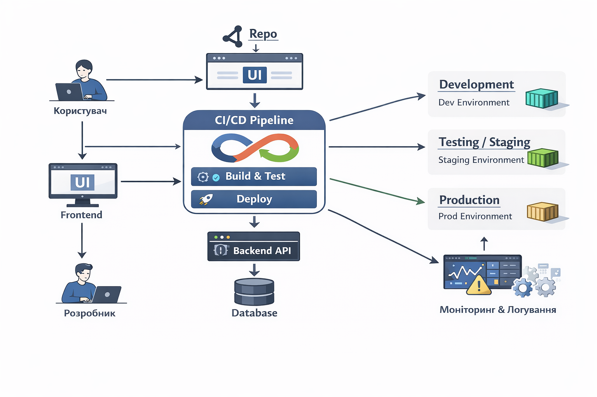

# 🧪 Лабораторна робота

## Проєктування DevOps-інфраструктури для вебзастосунку

---

## 🎯 Мета роботи

Метою роботи є ознайомлення з підходом DevOps та формування навичок аналізу системи, визначення середовищ розгортання, організації процесу доставки змін і супроводу програмного продукту.

---

## 📌 Опис системи

У роботі розглядається вебзастосунок для керування командними завданнями (аналог Jira), який складається з трьох основних компонентів:

* **Frontend** — відповідає за взаємодію з користувачем (інтерфейс у браузері)
* **Backend** — реалізує бізнес-логіку та обробку запитів через API
* **Database** — забезпечує зберігання даних (користувачі, проєкти, задачі)

Така архітектура дозволяє розділити відповідальність між компонентами та спростити масштабування системи.

---

## 🌍 Середовища розгортання

### 🔹 Development

Використовується розробниками для написання та тестування коду.
Може працювати локально або на окремому сервері.

### 🔹 Testing / Staging

Середовище, максимально наближене до production.
Застосовується для перевірки змін перед релізом (автоматичні та ручні тести).

### 🔹 Production

Основне робоче середовище для користувачів.
Вимагає високої стабільності, безпеки та доступності.

---

## ⚙️ DevOps-схема

Система включає такі елементи:

* користувач → взаємодіє через браузер
* frontend → надсилає запити до backend
* backend → обробляє запити та працює з базою даних
* database → зберігає всі дані
* Git-репозиторій → зберігає код
* CI/CD pipeline → автоматизує збірку, тестування та деплой
* середовища:
  `development → staging → production`

📌 

---

## 🚀 Процес доставки змін (CI/CD)

1. Розробник вносить зміни у код
2. Код відправляється у Git-репозиторій
3. Автоматично запускається CI:

   * збірка проєкту
   * запуск тестів
4. У разі успіху зміни потрапляють у staging
5. Після перевірки виконується деплой у production

Цей процес забезпечує швидке та безпечне впровадження змін.

---

## ⚙️ Конфігурація системи

Конфігураційні дані зберігаються окремо від коду (наприклад, у змінних середовища):

* адреси сервісів
* підключення до бази даних
* порти
* рівень логування
* секрети та токени

Це дозволяє змінювати параметри без зміни коду.

---

## 📊 Супровід системи

### 🔍 Логування

Фіксуються:

* дії користувачів
* помилки
* ключові події системи

### 📈 Моніторинг

Контролюється:

* навантаження серверів
* швидкість роботи API
* стан бази даних

### ⚠️ Обробка збоїв

У випадку проблем:

* виконується відкат до стабільної версії
* аналізуються логи
* вносяться виправлення та повторний реліз

---

## ✅ Висновки

У ході роботи було спроєктовано базову DevOps-інфраструктуру для вебзастосунку. Використання розділення на середовища, CI/CD-процесу, винесення конфігурації та інструментів моніторингу дозволяє забезпечити стабільну роботу системи, швидке впровадження змін та ефективний супровід.

